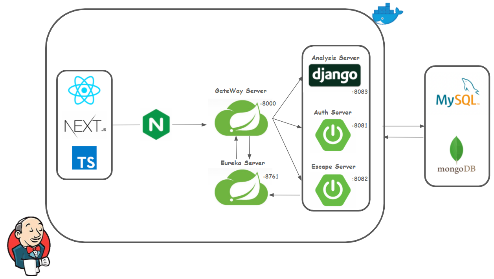
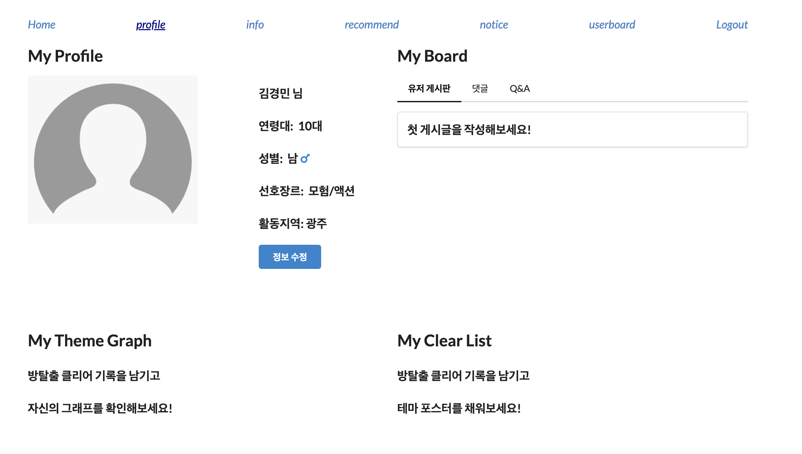
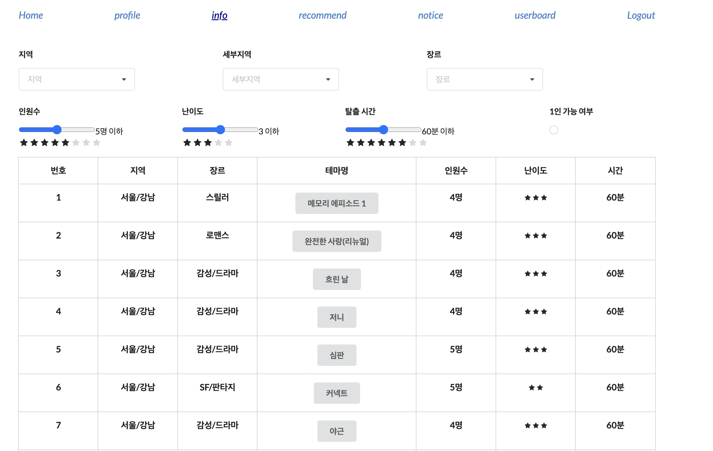
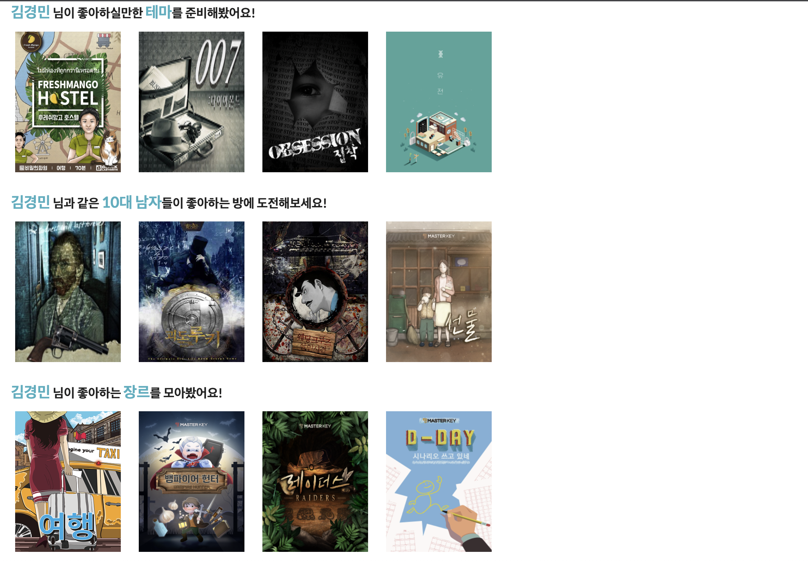
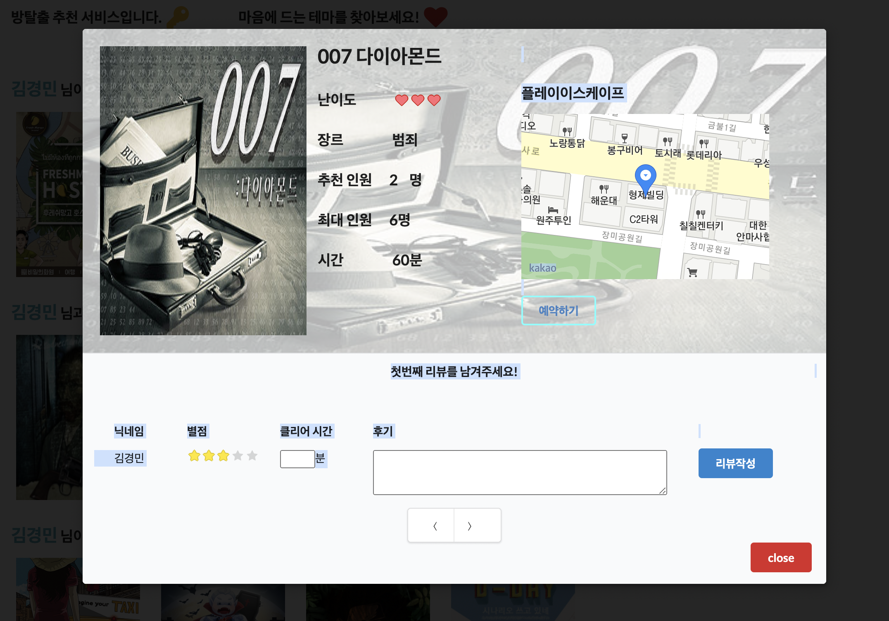
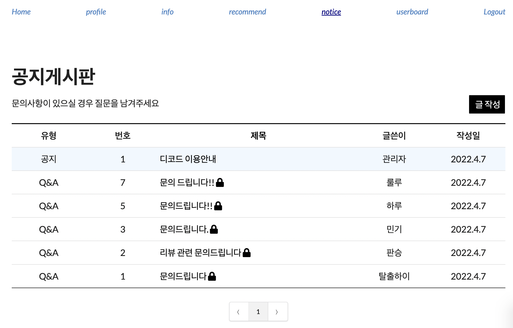
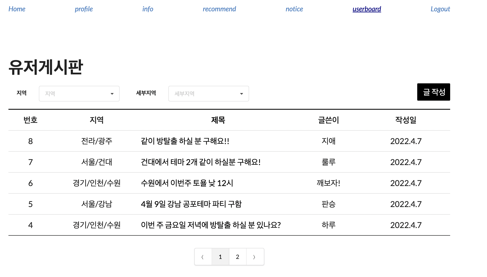

## :date: 프로젝트 소개

##### 안녕하세요

##### 유저 데이터 기반 방탈출 테마 추천 서비스 디코드입니다

##### 당신의 취향을 저격할 방탈출 테마가 궁금하지 않으신가요?

##### 방탈출 기록은 물론 취향저격 테마로 가득한 디코드로 여러분을 초대합니다.

* ##### 진행 기간: 2022.02.21 ~ 2022.04.08

* ##### 팀명: Decode

* ##### 목표: 유저 데이터를 기반으로 오프라인 방탈출 카페를 추천해주는 서비스

* ##### 프로젝트 세부 사항 노션 링크: https://axiomatic-lord-8f5.notion.site/2fea7ec47feb443c9105d3d85eb57362

  

## :raising_hand: 팀원소개
<table>
  <tr>
      <td align="center"><a href="https://github.com/smingi/"><br /><sub><b>손민기<br>Front-end,팀장</b></sub></a><br /></td>
      <td align="center"><a href="https://github.com/Panseung"><br /><sub><b>김승환<br>Front-end</b></sub></a><br /></td>
      <td align="center"><a href="https://github.com/hanuirangroovy"><br /><sub><b>하지애<br>Front-end</b></sub></a><br /></td>
    <td align="center"><a href="https://github.com/cheery72"><br /><sub><b>김경민<br>Back-end</b></sub></a><br /></td>
    <td align="center"><a href="https://github.com/sojin0706"><br /><sub><b>박소진<br>Back-end</b></sub></a><br /></td>
    <td align="center"><a href="https://github.com/cherrymaru"><br /><sub><b>오윤진<br>Back-end</b></sub></a><br /></td>
    </tr>
</table>


## :wrench: 기술스택

### Frontend
 <br />
 <br />
<br />
<br/>
<br />
<br/>


### Backend
 <br />
 <br />
<br /><br />


### DataBase

 <br />
 <br />


### Server

 <br /> <br /> <br />


##  :hammer: 아키텍처 이미지




## :bookmark_tabs: 페이지 소개

### 메인 페이지


#### 로그인 유저

 - 로그인한 유저 데이터를 기반으로 세가지 카테고리별 1위 방탈출 테마를 추천 받는 공간입니다.
 - 디코드가 보유한 데이터 수가 시각화되어 나타납니다.

#### 비로그인 유저

- 유저가 접속한 지역을 기반으로 방탈출 테마 중 평점 1위부터 3위 까지의 테마를 추천하여 제공합니다. 


### 프로필 페이지



유저가 클리어한 방탈출 테마 분석 그래프를 볼 수 있습니다.
닉네임, 선호도, 연령, 이미지, 지역 등 회원의 정보를 수정할 수 있습니다.
자신이 작성한 게시글, 댓글, QnA를 확인 할 수 있습니다.


### 정보 페이지



디코드가 보유한 방탈출 데이터들을 사용자들이 원하는 필터에 맞춰 확인 할 수 있습니다.
테마명 클릭시 테마 정보와 함께 방탈출 클리어한 유저들의 리뷰를 볼 수 있는 모달로 이동합니다.
테마명 클릭시 연결된 모달창에서 리뷰 확인 및 작성 기능을 제공합니다.


### 추천 페이지



컨텐츠 기반 필터링
- 로그인한 유저의 장르 선호도를 기반으로 추천을 제공합니다.

협업 필터링
- 로그인한 유저와 비슷한 유저(성별, 연령)집단이 좋아하는 테마를 추천을 제공합니다.

(비로그인)
- 지역별 평점 순위로 추천을 제공합니다.


### 테마 상세 페이지



테마 이름, 난이도, 장르 등 상세정보와 테마를 가지고 있는 카페위치, 예약 url을 제공합니다.
회원의 경우 리뷰를 작성하고 삭제할 수 있습니다.


### 공지사항 & QnA



관리자의 공지사항과 유저의 Q&A를 확인할 수 있는 공간으로 게시글 작성, 수정, 댓글 기능을 제공합니다.
관리자의 공지사항은 메인페이지 게시판 상단에서 확인 할 수 있습니다.
공개글/ 비밀글 선택 기능을 제공합니다.


### 유저 게시판

### 

유저들이 작성할 수 있는 게시판으로 게시글 작성, 수정, 댓글 기능을 제공합니다.
유저들이 작성한 글을 지역별로 확인 할 수 있습니다.


Frontend
```
패키지 설치
$ npm install
```
```
프로젝트 실행
$ npm run dev
```

Backend <br/>
Spring

```

```

Django <br />
```
$ python manage.py migrate
$ python manage.py runserver
```